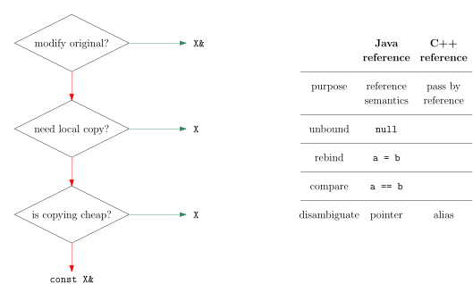
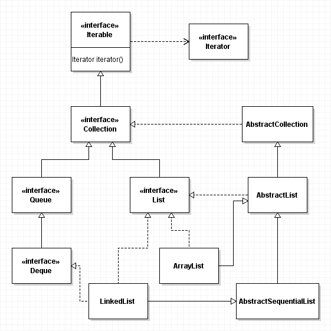
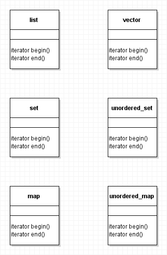

# C++ for Java programmers


> **Q:** Do you swear to tell the truth, the whole truth, and nothing but the truth, so help you [Godbolt](https://godbolt.org)?
>
> **A:** No. If I told you the whole truth, we'd still be sitting here next year.

## Introduction

### Primary domains

- Operating systems
- Drivers
- Codecs
- Embedded systems
- Compilers
- Emulators
- Virtual machines
- Browsers
- Games
- Multimedia
- High frequency trading

### Early history

- 1962 Simula (Dahl, Nygaard)
- 1967 BCPL (Richards)
- 1969 B (Thompson, Ritchie)
- 1972 C (Ritchie)
- 1979 C with classes (Stroustrup)


- 1983 C++
- 1985 Cfront 1.0, "The C++ Programming Language" 1st
- 1989 Cfront 2.0
- 1990 "The Annotated Reference Manual"
- 1991 "The C++ Programming Language" 2nd
- 1993 Standard Template Library (Stepanov)

### Standards

- C++98
- C++03
- 2005 Technical Report 1
- C++11
- C++14
- C++17
- C++20

### Hello World

```c++
#include <iostream>

int main() {
    std::cout << "Hello, World!\n";
}
```

```
g++ hello.cpp && a.exe
```

## Value semantics vs. Reference semantics

### Java classes have reference semantics

```java
class Account {
    private int balance;

    public Account(int initialBalance) {
        balance = initialBalance;
    }

    public void deposit(int amount) {
        balance += amount;
    }

    public void info() {
        int id = System.identityHashCode(this);
        System.out.println(id + " " + balance);
    }
}

class Main {
    public static void main(String[] args) {
        Account a = new Account(42);
        Account b = a;

        a.deposit(55);

        a.info();
        b.info();
    }
}
```


### C++ classes have value semantics

```c++
#include <iostream>

class Account {
    int balance;

public:

    Account(int initialBalance) {
        balance = initialBalance;
    }
    
    void deposit(int amount) {
        balance += amount;
    }

    void info() {
        std::cout << this << " " << balance << "\n";
    }
};

int main() {
    Account a(42);
    Account b = a;
    
    a.deposit(55);

    a.info();
    b.info();
}
```


## Pass by value vs. Pass by reference

### Java passes object references by value

```java
public class Pass {
    public static void swap(String a, String b) {
        String c = a;
        a = b;
        b = c;
        System.out.println(a + " " + b);
    }

    public static void main(String[] args) {
        String s = "world";
        String t = "hello";
        swap(s, t);
        System.out.println(s + " " + t);
    }
}
```


### C# supports pass by reference via `ref`

```c#
public class Pass
{
    public static void swap(ref string a, ref string b)
    {
        string c = a;
        a = b;
        b = c;
        Console.WriteLine(a + " " + b);
    }

    public static void Main()
    {
        string s = "world";
        string t = "hello";
        swap(ref s, ref t);
        Console.WriteLine(s + " " + t);
    }
}
```

### C++ supports multiple parameter passing mechanisms

> **Side note:** String literals with n characters have static storage duration and are of type `const char[n+1]` (+1 for the terminating NUL character), which have an implicit conversion to `const char*`, which has an implicit conversion to `std::string`.


```c++
#include <iostream>
#include <string>

void swap(std::string& a, std::string& b) {
    std::string c = a;
    a = b;
    b = c;
    std::cout << a << " " << b << "\n";
}

int main() {
    std::string s("world");
    std::string t("hello");
    swap(s, t);
    std::cout << s << " " << t << "\n";
}
```

| Pass by...         | Parameter type       | `f(variable)` | `f(constant)` | `f(value)` |
| ------------------ | -------------------- | :-----------: | :-----------: | :--------: |
| value              | `std::string`        | &#10003;      | &#10003;      | &#10003;   |
| reference          | `std::string&`       | &#10003;      |               |            |
| reference to const | `const std::string&` | &#10003;      | &#10003;      | &#10003;   |

```c++
// Pass by reference
void reverse(std::string& a) {
    std::reverse(a.begin(), a.end());
}

// Pass by value
std::string reversed(std::string a) {
    std::reverse(a.begin(), a.end());
    return a;
}

// Pass by reference to const
std::string reversed(const std::string& a) {
    std::string b(a.rbegin(), a.rend());
    return b;
}
```



## Resource management

### Java before 7

```java
import java.io.*;

public class Close {
    private static void backup() throws IOException {
        BufferedReader in = new BufferedReader(new FileReader("readme.txt"));
        BufferedWriter out = new BufferedWriter(new FileWriter("backup.txt"));

        String line;
        while ((line = in.readLine()) != null) {
            out.write(line);
            out.newLine();
            System.out.print('.');
        }
        System.out.println("done!");

        // Do you see the problem?
        out.close();
        in.close();
    }

    public static void main(String[] args) {
        try {
            backup();
        } catch (IOException ex) {
            ex.printStackTrace();
        }
    }
}
```

### Java 7 and later

```java
import java.io.*;

public class With {
    private static void backup() throws IOException {
        try (BufferedReader in = new BufferedReader(new FileReader("readme.txt"));
            BufferedWriter out = new BufferedWriter(new FileWriter("backup.txt"))) {

            String line;
            while ((line = in.readLine()) != null) {
                out.write(line);
                out.newLine();
                System.out.print('.');
            }
            System.out.println("done!");

            // Files are closed automatically
        }
    }

    public static void main(String[] args) {
        try {
            backup();
        } catch (IOException ex) {
            ex.printStackTrace();
        }
    }
}
```

### C++ destructors and RAII

```c++
#include <fstream>
#include <iostream>
#include <string>

void backup() {
    std::ifstream in("readme.txt");
    std::ofstream out("backup.txt");

    std::string line;
    while (std::getline(in, line)
        && out << line << "\n")
    {
        std::cout << '.';
    }
    std::cout << "done!\n";

    // out destructor closes backup.txt
    // in destructor closes readme.txt
}

int main() {
    try {
        backup();
    } catch (std::exception& ex) {
        std::cout << ex.what() << "\n";
    }
}
```

| Object                 | Constructor runs...      | Destructor runs...             | Storage duration |
| ---------------------- | ------------------------ | ------------------------------ | ---------------- |
| Global                 | before `main`            | after `main`                   | static           |
| Local                  | definition               | scope exit                     | automatic        |
| `static` local         | before first use         | after `main`                   | static           |
| Member `obj.m`         | before `obj` constructor | after `obj` destructor         | `obj`'s          |
| `static` member        | before `main`            | after `main`                   | static           |
| Temporary              | evaluation               | end of full-expression         | automatic        |
| Heap<sup>1</sup>       | `malloc`                 | `free`                         | dynamic          |
| Free store<sup>1</sup> | `new`                    | `delete`                       | dynamic          |
| One owner              | `std::make_unique`       | during owner's destructor      | dynamic          |
| Multiple owners        | `std::make_shared`       | during last owner's destructor | dynamic          |

<sup>1</sup> Encapsulate with RAII

### C solution

```c
#include <stdio.h>

void backup() {
    FILE* in = fopen("readme.txt", "r");
    if (!in) goto close0;

    FILE* out = fopen("backup.txt", "w");
    if (!out) goto close1;

    char line[1000000];
    while (fgets(line, sizeof line, in)
        && fputs(line, out) != EOF)
    {
        putchar('.');
    }
    puts("done!");

close2:
    fclose(out);
close1:
    fclose(in);
close0:
    ;
}

int main() {
    backup();
}
```

### RAII

```c++
#include <stdio.h>
#include <ios>
using ioex = std::ios_base::failure;

class Raiile {
public:
    FILE* handle;

    // Constructor
    Raiile(const char* filename, const char* mode) {
        handle = fopen(filename, mode);
        if (!handle) throw ioex(filename);
        printf("fopen %p %s\n", handle, filename);
    }

    // Destructor
    ~Raiile() {
        printf("fclose %p\n", handle);
        fclose(handle);
    }
};

void backup() {
    Raiile in("readme.txt", "r");
    Raiile out("backup.txt", "w");

    char line[1000000];
    while (fgets(line, sizeof line, in.handle)
        && fputs(line, out.handle) != EOF)
    {
        putchar('.');
    }
    puts("done!");
}

int main() {
    try {
        backup();
    } catch (std::exception& ex) {
        puts(ex.what());
    }
}
```

### Special member functions

Auto-generated copy constructor causes double-release in destructor:


Auto-generated copy assignment operator leaks old resource and causes double-release in destructor:


Custom move constructor should transfer ownership:


Custom move assignment operator should release old resource and transfer ownership:


```c++
    // Copy constructor
    // Raiile a = b;
    Raiile(const Raiile&) = delete;

    // Copy assignment operator
    // a = b;
    Raiile& operator=(const Raiile&) = delete;

    // Move constructor
    // Raiile a = Raiile("another.txt", "r");
    Raiile(Raiile&& that) {
        handle = that.handle;
        that.handle = nullptr;
    }

    // Move assignment operator
    // a = Raiile("another.txt", "r");
    Raiile& operator=(Raiile&& that) {
        if (this != &that) {
            if (handle) {
                printf("fclose %p\n", handle);
                fclose(handle);
            }

            handle = that.handle;
            that.handle = nullptr;
        }
        return *this;
    }

    // Destructor
    ~Raiile() {
        if (handle) {
            printf("fclose %p\n", handle);
            fclose(handle);
        }
    }
```

### Copy/Move and swap idiom


```c++
    // Raiile& operator=(const Raiile&)
    // Raiile& operator=(Raiile&& that)
    Raiile& operator=(Raiile that) {
        std::swap(handle, that.handle);
        return *this;
    }
```

## Account exercise

> - Add methods `withdraw` and `getBalance` to class `Account`
> - Store account movements in a `std::vector` member
> - Add method `printMovements`

## Header files

- A class definition is typically split into a **header file** and an **implementation file**:
  - The header file contains the class definition without *non-trivial* method bodies
  - The implementation file contains the *non-trivial* method bodies

MyClass.h
```c++
#pragma once // prevent multiple inclusions in same translation unit

#include "headers.h"
#include "for.h"
#include "this.h"
#include "header.h"

class MyClass {
    int x;
    std::string log;

public:

    void increment() {
        ++x;
    }

    void append(const std::string& line);
};
```
MyClass.cpp
```c++
#include "MyClass.h"

#include "additional.h"
#include "headers.h"
#include "for.h"
#include "this.h"
#include "implementation.h"

void MyClass::append(const std::string& line) {
    log += line;
    if (!line.empty() && line.back() != '\n') {
        log += '\n';
    }
}
```

> **Exercise:** Split class `Account` into `Account.h` and `Account.cpp`

### Translation phases


## Domain values

```c++
#include <iostream>
#include <string>

class Postleitgebiet {
    int postleitzahl;
    std::string stadt;

public:

    Postleitgebiet(int postleitzahl, std::string stadt)
    : postleitzahl(postleitzahl), stadt(std::move(stadt)) {
        // validate
    }

    int getPostleitzahl() const {
        return postleitzahl;
    }

    const std::string& getStadt() const {
        return stadt;
    }

    // domain methods
};

std::ostream& operator<<(std::ostream& os, const Postleitgebiet& gebiet) {
    return os << gebiet.getPostleitzahl() << " " << gebiet.getStadt();
}

bool operator==(const Postleitgebiet& a, const Postleitgebiet& b) {
    return a.getPostleitzahl() == b.getPostleitzahl()
        && a.getStadt() == b.getStadt();
}

// for use in associative containers
bool operator<(const Postleitgebiet& a, const Postleitgebiet& b) {
    if (a.getPostleitzahl() < b.getPostleitzahl()) return true;
    if (b.getPostleitzahl() < a.getPostleitzahl()) return false;
    return a.getStadt() < b.getStadt();
}

// for use in unordered containers
namespace std {
    template<>
    struct hash<Postleitgebiet> {
        size_t operator()(const Postleitgebiet& gebiet) const {
            return std::hash<int>()(gebiet.getPostleitzahl())
                 ^ std::hash<std::string>()(gebiet.getStadt());
        }
    };
}
```

## Standard Template Library


- Containers
  - Sequence containers: `array`, `vector`, `deque`, `list`, `forward_list`
  - Associative containers: `set`, `map`, `multiset`, `multimap`
  - Unordered associative containers: `unordered_set`, `unordered_map`, `unordered_multiset`, `unordered_multimap`
  - Container adaptors: `stack`, `queue`, `priority_queue`
- Iterators
- Algorithms
  - Non-modifying: `all_of`, `any_of`, `none_of`, `for_each`, `for_each_n`, `count`, `count_if`, `mismatch`, `find`, `find_if`, `find_if_not`, `find_end`, `find_first_of`, `adjacent_find`, `search`, `search_n`
  - Modifying: `copy`, `copy_if`, `copy_n`, `copy_backward`, `move`, `move_backward`, `fill`, `fill_n`, `transform`, `generate`, `generate_n`, `remove`, `remove_if`, `remove_copy`, `remove_copy_if`, `replace`, `replace_if`, `replace_copy`, `replace_copy_if`, `swap`, `swap_ranges`, `iter_swap`, `reverse`, `reverse_copy`, `rotate`, `rotate_copy`, `random_shuffle`, `shuffle`, `sample`, `unique`, `unique_copy`
  - Partitioning: `is_partitioned`, `partition`, `partition_copy`, `stable_partition`, `partition_point`
  - Sorting: `is_sorted`, `is_sorted_until`, `sort`, `partial_sort`, `partial_sort_copy`, `stable_sort`, `nth_element`
  - Binary search: `lower_bound`, `upper_bound`, `binary_search`, `equal_range`
  - Merge: `merge`, `inplace_merge`
  - Set: `includes`, `set_difference`, `set_intersection`, `set_symmetric_difference`, `set_union`
  - Heap: `is_heap`, `is_heap_until`, `make_heap`, `push_heap`, `pop_heap`, `sort_heap`
  - Minimum/maximum: `max`, `max_element`, `min`, `min_element`, `minmax`, `minmax_element`, `clamp`
  - Comparison: `equal`, `lexicographical_compare`
  - Permutation: `is_permutation`, `next_permutation`, `prev_permutation`
  - Numeric: `iota`, `accumulate`, `inner_product`, `adjacent_difference`, `partial_sum`, `reduce`, `exclusive_scan`, `inclusive_scan`, `transform_reduce`, `transform_exclusive_scan`, `transform_inclusive_scan`
  - Uninitialized memory: `uninitialized_copy`, `uninitialized_copy_n`, `uninitialized_fill`, `uninitialized_fill_n`, `uninitialized_move`, `uninitialized_move_n`, `uninitialized_default_construct`, `uninitialized_default_construct_n`, `uninitialized_value_construct`, `uninitialized_value_construct_n`, `destroy`, `destroy_at`, `destroy_n`
  - C: `bsearch`, `qsort`

### Java collections vs. C++ containers




### `std::vector`

```c++
#include <iostream>
#include <vector>

int main() {
    std::vector<int> v {2, 3, 5, 7};
    v.push_back(11);

    // index-based for loop
    for (std::vector<int>::size_type i = 0; i != v.size(); ++i) {
        std::cout << v[i] << "\n";
    }

    // iterator-based for loop
    for (auto it = v.begin(); it != v.end(); ++it) {
        std::cout << *it << "\n";
    }

    // range-based for loop
    for (int x : v) {
        std::cout << x << "\n";
    }
}
```

### `std::unordered_map`

```c++
#include <iostream>
#include <unordered_map>

int main() {
    std::unordered_map<std::string, int> m {{"one", 1}, {"two", 2}, {"three", 3}, {"four", 4}};
    m.emplace("five", 5);
    m["six"] = 6; // std::unordered_map::operator[] locates existing value or inserts default value

    for (const std::pair<const std::string, int>& p : m) {
        std::cout << p.first << ": " << p.second << "\n";
    }

    for (const auto& [word, number] : m) {
        std::cout << word << ": " << number << "\n";
    }

    auto it = m.find("tree");
    if (it != m.end()) {
        std::cout << it->first << ": " << it->second << "\n";
    } else {
        std::cout << "not found\n";
    }

    std::cout << m["five"]  << "\n"; // 5
    std::cout << m["six"]   << "\n"; // 6
    std::cout << m["seven"] << "\n"; // 0 (!)
    std::cout << m.size()   << "\n"; // 7 (!)
}
```

### `std::sort`

```c++
#include <algorithm>
#include <iostream>
#include <vector>

bool stringLengthLess(const std::string& a, const std::string& b) {
    return a.length() < b.length();
}

struct StringLengthLess {
    bool operator()(const std::string& a, const std::string& b) const {
        return a.length() < b.length();
    }
};

int main() {
    std::vector<std::string> names {
        "Emma", "Olivia", "Ava", "Isabella", "Sophia", "Charlotte", "Mia", "Amelia"
    };
    std::sort(names.begin(), names.end());
    std::cout << names.front() << " ... " << names.back() << "\n";

                                       // Function pointer
    std::sort(names.begin(), names.end(), stringLengthLess);

                                       // Function object
    std::sort(names.begin(), names.end(), StringLengthLess());

                                       // Lambda
    std::sort(names.begin(), names.end(), [](const std::string& a, const std::string& b) {
        return a.length() < b.length();
    });
}
```

### How thick is Moby Dick?

> - http://www.gutenberg.org/files/2489
> - Read all lines from Herman Melville's novel "Moby Dick"
>   - `std::ifstream`
>   - `std::getline`
> - Convert all letters in a line to lowercase
>   - `std::transform`
>   - `tolower`
> - Find all words in a line
>   - `std::find_if`
>   - `isalpha`
>   - `std::find_if_not`
> - How many different words are in the novel?
>   - `std::unordered_set<std::string>`
> - What are the 10 most frequently used words?
>   - `std::unordered_map<std::string, int>`
>   - `std::vector<std::pair<std::string, int>>`
>   - `std::partial_sort`

## Inheritance

```c++
#include <iostream>
#include <memory>
#include <string>

class Animal {
    std::string name;

public:

    Animal(const std::string& name) : name(name) {
    }

    virtual ~Animal() {
        std::cout << "~Animal()\n";
    }

    void communicate() {
        std::cout << name << " says: " << noise() << "\n";
    }

    private: virtual std::string noise() = 0;
};

class Cat : public Animal {
public:
    Cat(const std::string& name) : Animal(name) {
    }

    ~Cat() {
        std::cout << "~Cat()\n";
    }

    std::string noise() override {
        return "meow";
    }
};

class Dog : public Animal {
public:
    Dog(const std::string& name) : Animal(name) {
    }

    ~Dog() {
        std::cout << "~Dog()\n";
    }

    std::string noise() override {
        return "wuff";
    }
};

std::unique_ptr<Animal> makeAnimal(const std::string& name) {
    static bool flag = false;
    if (flag = !flag) {
        return std::make_unique<Cat>(name);
    } else {
        return std::make_unique<Dog>(name);
    }
}

int main() {
    auto a = makeAnimal("Alice");
    auto b = makeAnimal("Bob");

    a->communicate();
    b->communicate();
}
```

## Dessert

- Implement simple `string` class
- Implement simple `vector` class

## Suggested reading

- https://isocpp.org
- https://en.cppreference.com
- Bjarne Stroustrup – A Tour of C++
- Lippman/Lajoie/Moo – C++ Primer
- Scott Meyers – Effective C++ / Effective STL / Effective Modern C++
- Nicolai Josuttis – C++17 The Complete Guide
